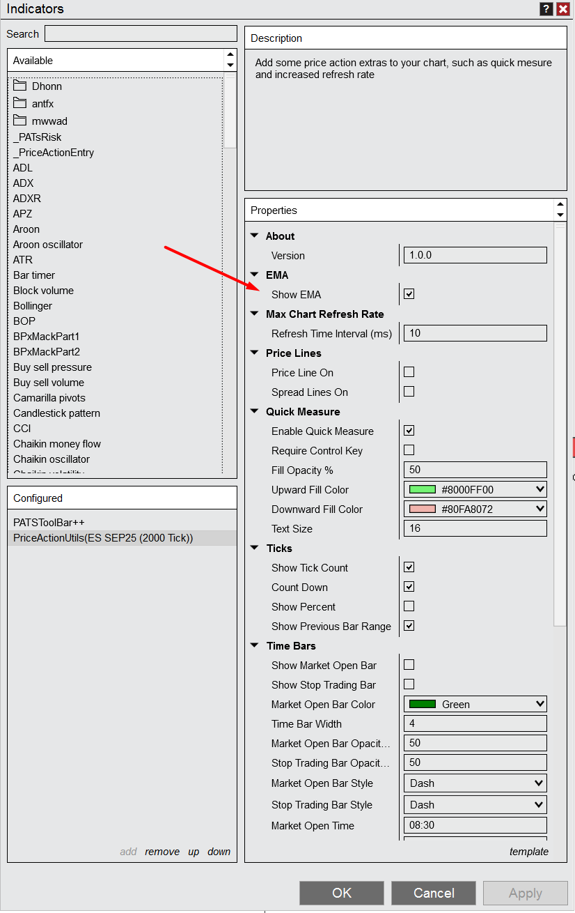
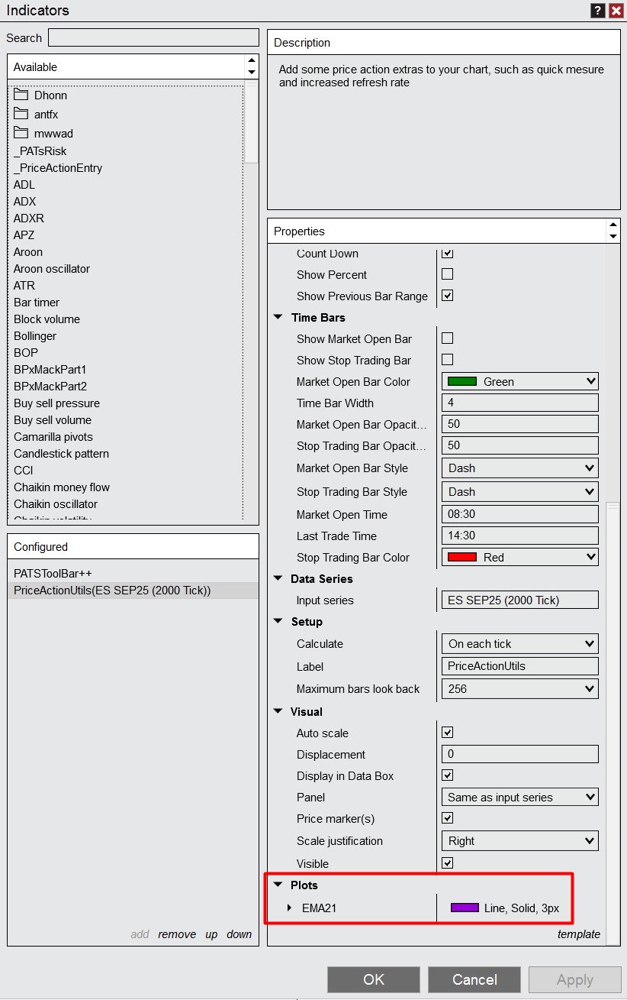

# Price Action Utils
PriceActionUtils is a simple NinjaTrader 8 indicator that adds a few nice features to your chart, it was created to conbine the functionallity of some other indicators to help keep the setup clean such as:

1. 21 EMA
2. Price & Spread lines
3. Remaining tick count and Previous bar's range
5. Market hour lines
6. Automatic 2nd chart tick offset (for second chart setup)
7. Increase chart refresh rate

### 21 EMA

This one is pretty basic but it saves you from having to add an extra indicator to the chart.

You can enable/disable this option in the indicator settings

And you can adjust the plot line at the bottom

### Price & Spread Lines

Add last price and current spread lines to the chart:

These lines can be enabled and disabled in the settings

### Remaining tick count and Previous bar's range

It's helpful to see the number of ticks left in the current bar as well as the size of the previous bar that would be used as the entry bar. This can be disabled directly on the chart next to the current bar

Settings for this feature include enabling/disabling the feature, showing the ticks as the current tick count or as a countdown and showing the current percentage.

### Market hour lines

I like to see when the regular market opens and when I should stop looking for trades because it's getting too late in the day. To help with that the indicator can automatically draw lines at configurable times that represent the regular market open time and when you consider it to be 'too late' to be trading.

### 2nd Chart bar type

Finally we have a second chart bar type. Some traders like to keep their eye on a 'second chart' which is the same as a normal 2000 tick chart but with an offset applied to the ticks so that we see slightly different bars. This can be useful for seeing additional setups.

This bar type works by dividing the period in 2 and skipping that number of ticks at the start of each session. For example, in a 2000 tick chart the offset will be 1000 ticks so at the start of each session the bar type will ignore the first 1000 ticks therefore creating a difference of 1000 ticks between the two charts.

Here's what that looks like. Notice that the two charts have slightly differnt bars and that the tick count is different by 1000 ticks.

To set this up you just need to double click on the data series and select the "2nd Chart Tick" bar type. This bar type will also work fine with the built in tick counter.

### Increase chart refresh rate

The default refresh rate in NinjaTrader can be a little slow so the indicator allows you to increase that which gives a much more fluid experience. You can configure the maximum refresh rate in the indicator settings.

