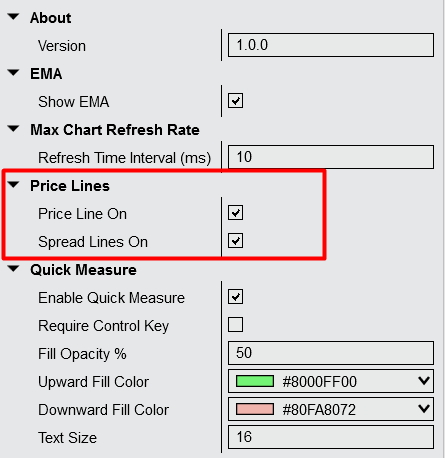

# PriceActionUtils for NinjaTrader 8

PriceActionUtils is a NinjaTrader 8 indicator that combines multiple chart analysis tools into a single indicator. It consolidates functionality from several separate indicators to reduce chart clutter and improve performance.

## WARNING

USE AT YOUR OWN RISK. This plugin has not been tested by third parties and is provided without warranty. Please test thoroughly with simulation accounts before using with live accounts. The author is not responsible for any issues, losses, or damages that may occur from using this plugin.

## Features

The indicator includes the following components:

1. **Automatic 2nd Chart Tick Offset** - Creates offset tick charts for alternative bar formations
2. **Quick Measure Tool** - Right-click drag measurement functionality
3. **Enhanced Chart Refresh Rate** - Configurable chart refresh rate improvements
4. **Market Hour Lines** - Automated time-based reference lines
5. **Price & Spread Lines** - Current price and bid/ask spread display
6. **Tick Analytics** - Remaining tick count and previous bar range information
7. **21 EMA** - Built-in exponential moving average

---

## "2nd Chart" Bar Type

The "2nd Chart" Tick bar type creates an offset version of standard tick charts. This allows traders to view the same market data with different bar formations, which can help identify additional patterns or setups.

**Implementation:**
The bar type calculates a 50% offset based on the selected tick period. For example, a 2000-tick chart will have a 1000-tick offset. At the beginning of each session, the first half of the ticks are ignored, creating bars that form differently from the standard chart while maintaining the same tick period.

**Technical Details:**
- Offset is automatically calculated as 50% of the tick period
- Tick counting remains consistent with standard tick charts
- Session-based reset ensures proper offset timing
- Compatible with existing NinjaTrader tick counter functionality

**Setup:**
1. Right-click on chart and select Data Series
2. Select "2nd Chart Tick" from the bar type dropdown
3. Set the desired tick period
4. The offset will be applied automatically

## Quick Measure Tool

The Quick Measure Tool allows measurement between any two points on the chart using a right-click and drag motion. Measurements are displayed in both points and percentage values.

**Usage:**
- Right-click and drag between two points to measure distance
- Results show both point difference and percentage change
- No additional drawing tools required
- Measurements clear automatically when released

**Configuration:**
The tool can be enabled or disabled through the indicator settings. Display options include line color, style, and whether to show measurements in points, percentage, or both.

## Enhanced Chart Refresh Rate

This feature increases the chart refresh rate beyond NinjaTrader's default setting. The improved refresh rate provides smoother chart updates, particularly during periods of high market activity.

**Configuration:**
The maximum refresh rate can be adjusted in the indicator settings. Higher refresh rates provide smoother chart performance but may require additional system resources.

## Market Hour Lines

Market Hour Lines draw vertical lines at specified times to mark important session periods. This feature helps identify regular market open times and other significant time-based reference points.

**Functionality:**
- Draws lines at configurable times
- Supports multiple time markers per session
- Lines can be customized for color and style
- Automatically adjusts for different time zones

**Configuration:**
Times are set in the indicator settings panel. Multiple time markers can be configured, with options to enable or disable individual lines as needed.

## Price & Spread Lines

This feature displays horizontal lines showing the current last price and bid/ask spread. The lines update in real-time as market conditions change.

**Display Elements:**
- Last traded price line
- Current bid/ask spread visualization
- Real-time updates with market movement
- Configurable line appearance

**Settings:**
Both price and spread lines can be enabled or disabled independently. Line colors, styles, and display options are configurable through the indicator settings.

## Remaining Tick Counter & Last Bar Size

The Tick Analytics component displays information about the current bar's progress and the previous completed bar's characteristics.

**Information Displayed:**
- Remaining tick count for the current bar
- Previous bar's range (high to low)
- Current bar completion percentage (optional)
- Display modes: countdown or count-up

**Configuration:**
The feature can be toggled on or off directly from the chart. Settings include display mode (countdown vs count-up), percentage display options, and text formatting preferences.

## 21 EMA

A standard 21-period exponential moving average is included in the indicator. This eliminates the need to add a separate EMA indicator to the chart.

**Features:**
- Standard EMA calculation using 21 periods
- Configurable plot appearance
- Can be enabled or disabled in settings
- Minimal performance impact

## Installation

1. Import the indicator files into NinjaTrader 8 through Tools > Import > NinjaScript Add-On
2. Add to chart by right-clicking chart > Indicators > PriceActionUtils
3. Configure features through the indicator settings panel
4. Adjust individual feature settings as needed

## Notes

Each feature can be enabled or disabled independently through the indicator settings. The indicator is designed to minimize performance impact while providing multiple chart analysis tools in a single package.
